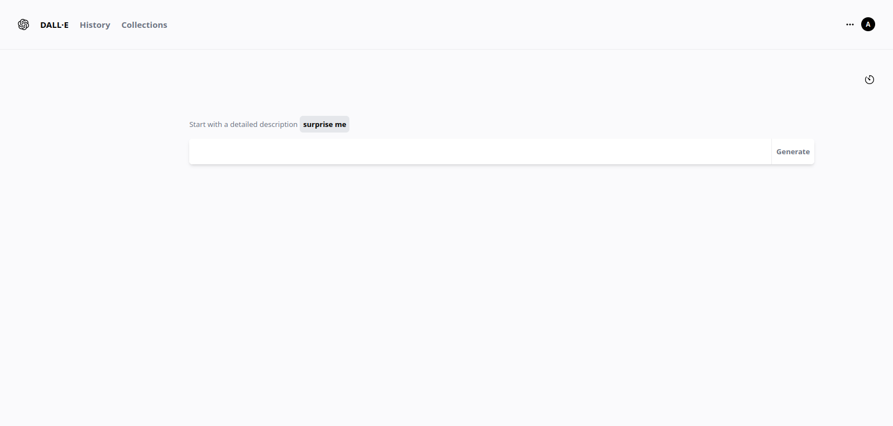
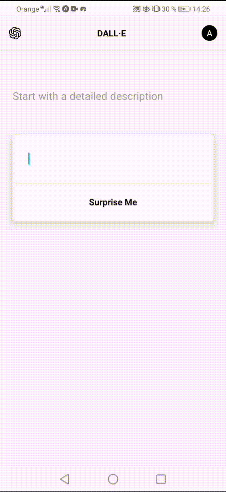

# Dall.e Clone using react.js and vue

## demo




## web

to run the project use 

```
    npm run dev
```

## mobile

to run the project using expo use

```
    npm run start
```

or 
```
    npm run android/ios
```

## stack

 - react.js/react-native with Typescript
 - vue.js
 - openai api
 - tailwind for css

### important note:

you should use your openai key to consume the data

create a .env file

 - for the web use ```VITE_KEY=key```
 - for the mobile use ```REACT_APP_KEY=key```